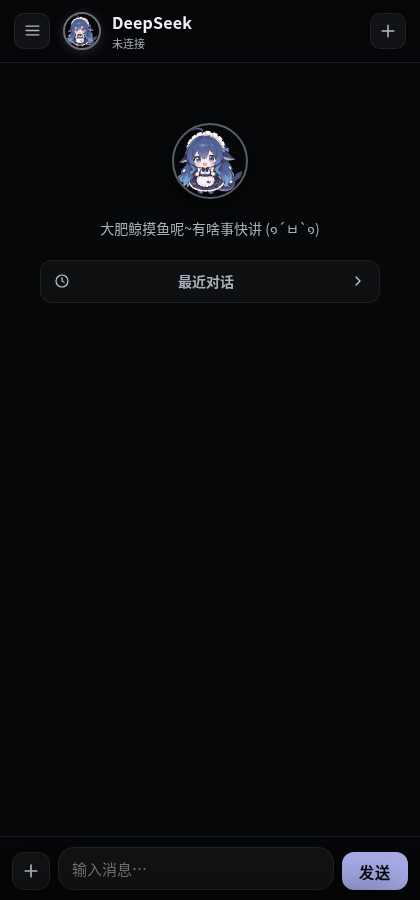
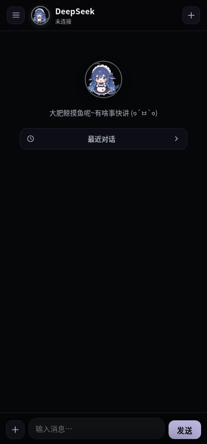
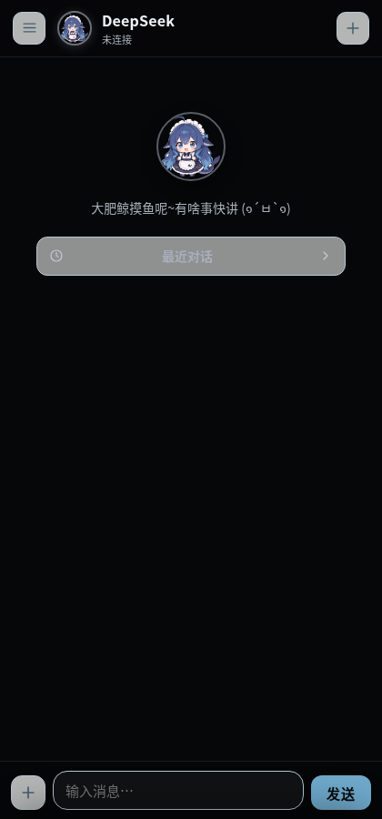
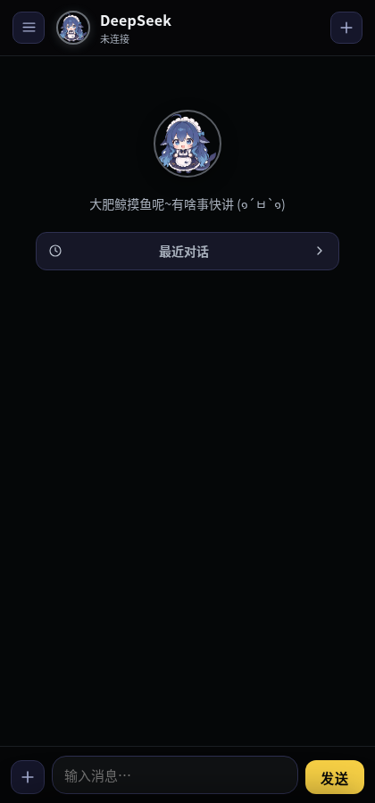
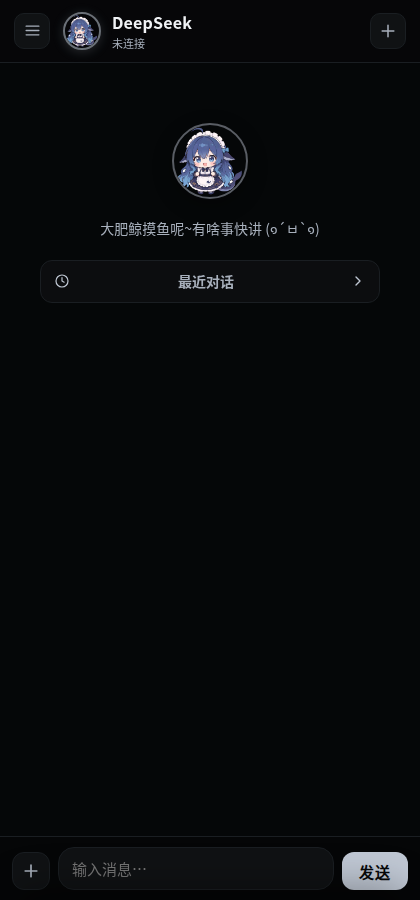
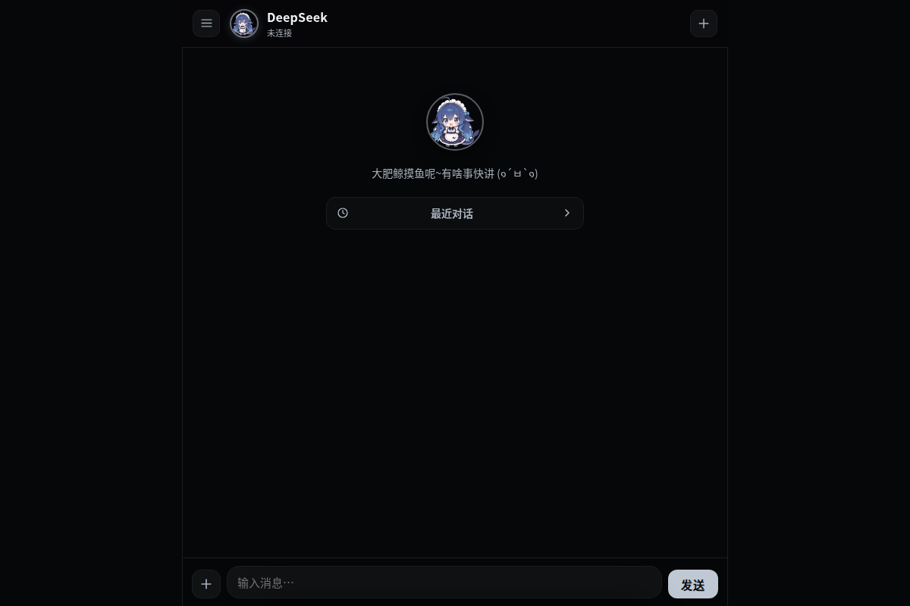

# DeepSeek Harness 手机工作媒介 📱

> **手机浏览器即用 · 外网可访问 · 7 套精美主题 · PWA 离线可用**

无需安装 App，手机浏览器打开就能用 DeepSeek Harness 智能体。通过 Zerotier 虚拟局域网，**内外网同一个地址**，出门在外也能随时指挥家里的 AI 干活。

---

## 🎨 界面预览（7 套主题）

| 高级黑 | 磨砂玻璃 | 梦幻渐变 | 清新自然 |
|:---:|:---:|:---:|:---:|
|  |  |  |  |

| 冰态果冻 | 奶茶店 | 像素风 |
|:---:|:---:|:---:|
|  |  |  |

> 💡 主题在右上角或设置面板中一键切换，偏好自动保存。

### 🖼️ 功能界面

| 抽屉导航 | 设置面板 | 桌面全景 |
|:---:|:---:|:---:|
|  |  |  |

---

## ✨ 特色功能

| 功能 | 说明 |
|------|------|
| 🧠 **智能体对话** | 对接 DeepSeek Harness，SSE 流式打字回显，支持多轮上下文 |
| 📂 **文件树浏览** | 实时查看工作目录，支持下载产出文件，目录折叠展开 |
| 📤 **文件上传** | 上传文件给智能体处理，支持对话附件 + 直接上传到工作目录 |
| 🔀 **模型切换** | 按提供方分组，一键切换模型，新会话自动应用 |
| ❓ **问题确认** | 智能体不确定时弹出确认卡片，复刻正式版 ask_user_question 交互 |
| 📱 **PWA 支持** | 添加到手机主屏幕，有独立图标和启动画面，像原生 App |
| 🌐 **内外网穿透** | 通过 Zerotier 虚拟局域网，出门在外同一地址访问家里的 AI |
| 🔒 **访问口令** | 可选 token 鉴权，公网暴露也安全 |
| 🎭 **毛玻璃特效** | 可调节的 UI 毛玻璃 + 背景毛玻璃，配合花边装饰 |
| 🐋 **鲸鱼娘主题** | 可爱的像素鲸鱼 / 女仆鲸鱼娘形象，颜文字交互 |

---

## 🎭 界面风格（7 套）

| # | 主题名 | 风格描述 |
|---|--------|----------|
| 1 | **高级黑** `premium-black` | 深邃纯黑底色，极致对比度，OLED 屏幕省电 |
| 2 | **磨砂玻璃** `frosted-glass` | 毛玻璃质感，半透明层叠，现代科技感 |
| 3 | **梦幻渐变** `dreamy-gradient` | 紫色渐变背景，梦幻氛围 |
| 4 | **清新自然** `forest-green` | 深绿基调，护眼舒适 |
| 5 | **冰态果冻** `ice-jelly` | 浅色冰蓝，清爽通透，适合白天 |
| 6 | **奶茶店** `milk-tea` | 暖米色调，温馨舒适 |
| 7 | **像素风** `pixel` | 复古像素风格，像素鲸鱼头像，8-bit 情怀 |

---

## 📁 目录结构

```
手机工作媒介/
├── mobile/            # 手机 PWA 前端（纯静态，7 主题）
│   ├── index.html
│   ├── styles.css
│   ├── app.js
│   ├── manifest.webmanifest
│   └── assets/        # 头像、装饰图、字体、截图
├── bridge/            # Node 桥接服务（零第三方依赖）
│   └── server.mjs
├── deploy/            # 部署脚本与 systemd 单元
│   ├── start.sh
│   └── workbench.service
└── 工作计划.md
```

---

## 🚀 快速启动

```bash
cd bridge
node server.mjs
# 或
bash ../deploy/start.sh
```

打开 `http://127.0.0.1:8090`，手机浏览器可「添加到主屏幕」作为 App 使用。

---

## ⚙️ 配置

| 环境变量 | 默认值 | 说明 |
|----------|--------|------|
| `WORKBENCH_PORT` | `8090` | 桥接监听端口 |
| `WORKBENCH_HOST` | `127.0.0.1` | 监听地址；内外网设 `0.0.0.0` |
| `WORKBENCH_DSH_BASE` | `http://127.0.0.1:3080` | DeepSeek Harness Web 地址 |
| `WORKBENCH_WORK_DIRS` | 上级目录 | 冒号分隔的文件根目录 |
| `WORKBENCH_ACCESS_TOKEN` | 空 | 访问口令（暴露公网强烈建议设置） |

---

## 🌐 Zerotier 内外网穿透

1. 本机安装 zerotier-one 并加入你的 Zerotier 网络
2. 获取本机 Zerotier 地址（`ip -4 addr show zt*`）
3. 桥接服务监听 `0.0.0.0` + 设置访问口令
4. 手机安装 Zerotier One、加入同一网络并授权
5. 访问：`http://<Zerotier地址>:8090/?token=<口令>`

> 同一 Zerotier 网络内，内外网都用这一个地址，出门在外也能指挥家里的 AI。

---

## 🔧 开机自启（systemd）

```bash
sudo cp deploy/workbench.service /etc/systemd/system/workbench.service
# 编辑 /etc/systemd/system/workbench.service，修改 User / 路径 / 口令
sudo systemctl daemon-reload
sudo systemctl enable --now workbench
```

---

## 📡 API 接口

| 方法 | 路径 | 说明 |
|------|------|------|
| GET | `/api/health` | 健康检查 |
| GET | `/api/sessions` | 近期对话列表 |
| GET | `/api/sessions/:id` | 某会话历史消息 |
| POST | `/api/chat` | 发消息，SSE 流式返回 |
| POST | `/api/chat/respond` | 回答智能体确认问题 |
| GET | `/api/files` | 文件列表 |
| GET | `/api/files/tree` | 文件树（含目录层级） |
| GET | `/api/files/download?path=` | 下载文件 |
| POST | `/api/upload` | 上传文件（multipart） |
| GET | `/api/models` | 模型列表 |
| POST | `/api/models/switch` | 切换模型 |

---

## 📝 说明

- 桥接服务**零第三方依赖**（Node ≥ 22 原生 fetch/http/fs）
- 聊天采用「发送后轮询历史」方式流式回显，比 token 级流式更稳定
- 桥接服务与 DSH web 需在同一台机器（DSH 默认只监听 127.0.0.1）
- 建议配合 Zerotier + 访问口令使用，安全可控